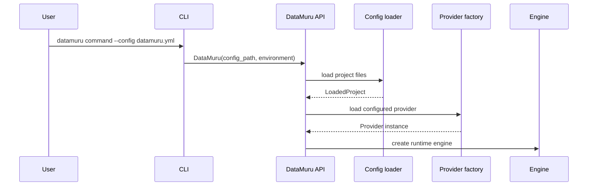
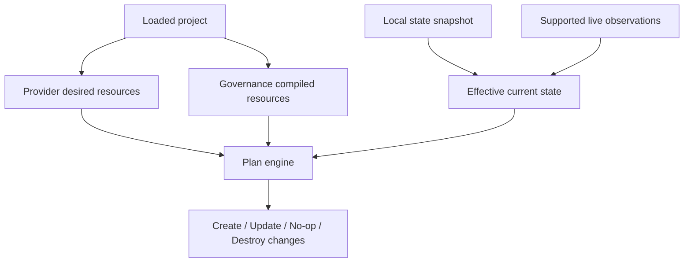
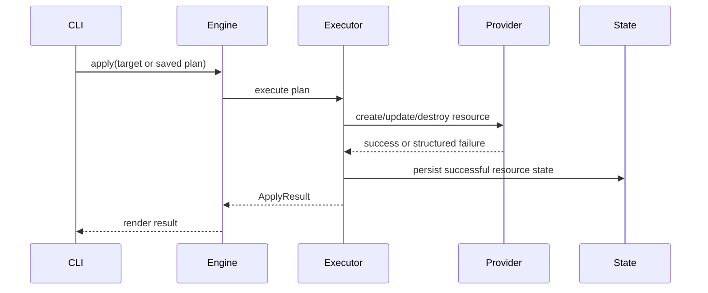

# Command Lifecycle

This page explains what happens inside DataMuru when a user runs the main CLI
commands. Use it when you need to debug behavior, design a new command, or
understand where a feature belongs.

## The rule of the CLI

The CLI is a product interface, not the product engine. A command should:

- parse arguments;
- call the Python API;
- render text, JSON, or structured errors;
- exit with a predictable status code.

The command should not parse provider YAML, compare resources, call Databricks
directly, compile governance policy, or mutate state on its own.

## Shared startup path

Most commands follow the same startup sequence:

This shared path keeps command behavior consistent. If one command understands
environment selection, provider loading, or edition checks differently from
another command, that is a design smell.

## `validate`

`validate` is the earliest safety gate. It checks whether the project can be
loaded and whether the declarations make sense before provider mutation is even
possible.

What it does:

- loads `datamuru.yml`;
- resolves referenced provider, workspace, and governance files;
- interpolates supported environment references;
- validates required fields and known enum values;
- checks edition-aware declarations;
- returns warnings and errors.

What it does not do:

- create cloud resources;
- require provider connectivity for every check;
- treat warnings as failures unless `--strict` is used.

## `doctor`

`doctor` answers a different question from `validate`: "Can this configured
environment talk to the provider in the way this project expects?"

Typical checks include:

- provider name and cloud;
- credential environment variables;
- configured execution mode;
- Databricks workspace connectivity;
- SQL warehouse availability for default-storage catalog creation and grants;
- identity-management capability where Enterprise identity declarations appear.

`doctor` should prefer actionable diagnostics over raw stack traces. The result
should tell an operator what is missing, why it matters, and what to do next.

## `plan`

`plan` turns declared intent into a reviewable change set.

The plan engine uses normalized fingerprints. A resource is an update when the
declared fingerprint differs from the effective current fingerprint. It is a
no-op when they match.

Targeting happens during planning. This matters because targets often imply
related resources:

- a catalog target includes declared schemas under that catalog;
- a group target includes declared group memberships;
- an exact resource address should not accidentally match a similarly named
  resource.

## Saved plans

A saved plan separates review time from execution time.

When a plan is saved, DataMuru records:

- plan schema version;
- project name and version;
- selected environment;
- provider and cloud;
- optional target;
- configuration fingerprint;
- plan body.

When the plan is applied later, DataMuru verifies that the current
configuration still matches the saved fingerprint. If the configuration changed,
the saved plan is rejected. This prevents approving one configuration and
executing another.

## `apply`

`apply` executes reviewed changes in dependency-aware order.

Important apply rules:

- no-op changes are skipped;
- child resources are skipped when a required parent failed;
- state is updated after successful resource operations;
- provider failures are returned as structured failures;
- apply is not globally transactional.

That last point is deliberate. Most cloud/provider APIs are not transactional
across many resource types. DataMuru should make partial success visible and
recoverable rather than pretending every apply can roll back perfectly.

## `destroy`

`destroy` uses the same planning and provider execution model, but it requires
explicit destructive intent.

Safety expectations:

- require `--confirm-destroy`;
- support narrow targets;
- preserve provider error context;
- block identity deletion unless explicitly allowed by resource policy;
- avoid deleting provider-owned system resources.

## `import discover`

Discovery reads supported live provider resources and reports them. It does not
change YAML and does not write state.

The design purpose is to let teams understand what exists before deciding what
should be managed by DataMuru.

## `import generate`

Generation converts discovered resources into reviewable YAML. This is a
bridge from brownfield environments to declarative management.

Generated configuration should be treated as a draft:

- review names and ownership;
- remove resources that should stay unmanaged;
- normalize conventions;
- commit only intentional declarations.

## `import adopt`

Adoption records matching live resources into DataMuru state. It is intentionally
guarded because adoption changes what DataMuru considers already managed.

Adoption should:

- require explicit targets;
- preview by default;
- verify that the live resource exists;
- verify that the live fingerprint matches the declared fingerprint;
- write state only when approved.

## Where new behavior belongs

| If you are adding... | Put the behavior in... |
| --- | --- |
| A new command flag | CLI command module, then pass through to API. |
| A new reusable operation | Python API and engine layer. |
| A new config field | Config model, schema, validation, docs, and examples. |
| A new resource type | Provider desired resources, provider operation, state tests, docs. |
| A new governance primitive | Governance compiler, resource descriptor, docs, validation. |
| A new platform | Provider package and provider factory registration. |
| A new Enterprise-only feature | Edition checks plus Enterprise implementation module. |

## Product-quality checklist

A command is not complete when it "works once." It is complete when it has:

- documented prerequisites;
- validation behavior;
- doctor diagnostics if provider capability matters;
- text output for humans;
- JSON output when automation needs it;
- structured errors with suggestions;
- unit or contract tests;
- at least one docs example;
- clear OSS or Enterprise positioning.
