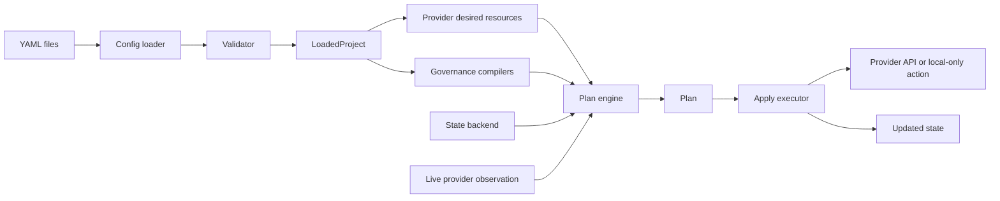

# Library Architecture

This page explains DataMuru as a Python library and product framework. It is
intended for engineers who need to extend the package, evaluate its design, or
understand why the CLI behaves the way it does.

## Architecture in one sentence

DataMuru is a typed Python orchestration core with a thin CLI, declarative YAML
contracts, local and future remote state backends, provider adapters, and
governance compilers that turn product intent into deterministic resources.

## Package map

```text
datamuru/
  api.py                  Python API facade
  bootstrap.py            project scaffolding used by datamuru init
  edition.py              OSS and Enterprise feature boundary rules
  errors.py               structured product error model
  cli/                    Click commands and Rich output
  core/
    config/               load, interpolate, validate, resolve project config
    state/                state models and backend contracts
    plan/                 resource descriptors, fingerprints, saved plans
    apply/                plan execution and apply results
    importer/             discovery, YAML generation, and state adoption
  governance/             taxonomy, RBAC, and masking compilers
  providers/
    base.py               provider protocol
    factory.py            provider loading
    databricks/           first live provider implementation
```

The repository also contains public contracts outside the importable package:

```text
schemas/                  JSON schema artifacts for config shape
docs/                     product documentation published with MkDocs
examples/                 runnable example projects
tests/                    unit, contract, and e2e-style tests
```

## Product architecture viewpoint

DataMuru should be understood as four cooperating products inside one package:

| Product surface | User question it answers | Main implementation area |
| --- | --- | --- |
| CLI | "How do I operate this from a terminal or CI job?" | `datamuru/cli/` |
| Python API | "How do I embed this in automation?" | `datamuru/api.py`, engine modules |
| Provider runtime | "How does declared intent become platform behavior?" | `datamuru/providers/` |
| Governance compiler | "How do policy and access intent join the same lifecycle?" | `datamuru/governance/` |

This split matters because DataMuru is not intended to become a pile of
Databricks scripts. The CLI can change shape, the provider list can grow, and
Enterprise modules can add deeper workflows without rewriting the planning
contract.

## Runtime Flow



The CLI does not own business logic. It calls the same Python API that
automation can use directly.

## End-to-end mental model

Every meaningful operation follows the same product loop:

1. **Load intent.** Read the root config, selected environment, provider file,
   workspace files, and governance files.
2. **Normalize intent.** Convert YAML and compiler outputs into typed resource
   descriptors.
3. **Understand current state.** Combine local state with supported live
   provider observations.
4. **Compare.** Produce deterministic create, update, no-op, and destroy
   changes.
5. **Execute deliberately.** Apply only reviewed changes and persist successful
   outcomes.
6. **Explain.** Return human-readable output and machine-readable result
   objects.

This loop is the backbone of the product. New commands should strengthen this
loop rather than bypass it.

## Public Python API

`datamuru.api.DataMuru` is the intended high-level entry point:

```python
from datamuru import DataMuru

dm = DataMuru("datamuru.yml")
issues = dm.validate()
plan = dm.plan(target="catalog:dm_sales")
result = dm.apply(target="catalog:dm_sales")
```

The API wraps `DataMuruEngine`, which coordinates config loading, provider
loading, planning, applying, imports, and edition summaries.

## Configuration Layer

The config layer owns YAML loading, `${env:NAME}` interpolation, validation,
environment resolution, provider config loading, workspace loading, and
governance file loading.

The output is a `LoadedProject`: a typed in-memory view of the project root,
selected environment, provider data, workspace files, and governance files.

Design rule: provider code should not parse raw files directly. It should
consume the loaded project object.

Configuration is also a public contract. A field is not ready just because the
runtime accepts it. It should have schema coverage, examples, reference docs,
and validation messages that explain failure in operator language.

## Resource Model

DataMuru uses a common `ResourceDescriptor`:

```text
resource_type
name
attributes
address = "{resource_type}:{name}"
```

Examples:

```text
catalog:dm_sales
schema:dm_sales.raw
permission_binding:data-consumers:curated_reader
group:dm-smoke-consumers
```

This common descriptor lets the core plan/apply engine stay provider-neutral.
Providers can add attributes, but the core can still compare, target, and
persist resources without knowing every platform API.

## Planning Model

The plan engine compares desired resources with the effective current state.
Effective current state can include local state records and supported live
provider observations.

Plan actions are `create`, `update`, `noop`, and `destroy`. Each resource is
fingerprinted from its normalized descriptor. If the desired fingerprint differs
from the current fingerprint, DataMuru reports an update.

Targeting is part of planning, not a post-filter. For example:

- `catalog:dm_sales` includes the catalog and its declared schemas.
- `group:analytics` includes the group and its group memberships.
- exact identity targets do not match similarly named identities.

The planner should be deterministic enough that the same config and same
current state produce the same plan. This is important for pull requests, CI,
saved-plan review, and enterprise change governance.

## Apply Model

The apply executor receives a reviewed plan and executes it in dependency-aware
order.

Important behavior:

- `noop` changes are skipped;
- schemas are skipped when their parent catalog fails;
- provider errors are preserved as structured apply failures;
- state is updated only after a successful resource operation;
- apply is not globally transactional.

Apply failures include resource, reason, code, title, context, and suggestion.

## Saved Plans

Saved plans separate review from execution. A saved plan contains schema
version, creation timestamp, project name and version, environment, provider,
cloud, config fingerprint, optional target, and the plan body.

When applying a saved plan, DataMuru checks that the current configuration still
matches the saved fingerprint. If config changed after review, the saved plan is
rejected as stale.

## State Layer

The state layer defines a backend contract and typed state snapshots.

Current OSS alpha backend:

- local JSON file.

Reserved backend directions:

- S3;
- Azure Blob;
- GCS;
- Enterprise or hosted state services.

State is an execution artifact, not source-of-truth configuration. Users should
not hand-edit state files.

## Provider Layer

The provider layer translates loaded project intent into provider-specific
resources and operations.

The base provider contract covers:

- authentication/readiness checks;
- desired resource construction;
- supported live-state observation;
- resource apply and destroy;
- discovery and import hooks.

The current live provider is Databricks. It supports Azure-first workflows and
keeps AWS/GCP as architectural targets rather than full alpha parity.

Provider implementations are allowed to know platform-specific details such as
Databricks REST endpoints, SQL warehouses, default storage behavior, SCIM
constraints, cloud identity, and provider-owned system resources. The core
planner should not need those details.

## Databricks Provider Internals

`datamuru/providers/databricks/` is split into:

| Module | Responsibility |
| --- | --- |
| `auth.py` | Provider auth config, PAT/env resolution, execution-mode helpers. |
| `client.py` | Raw Databricks HTTP/API interactions and SQL statement execution. |
| `execution.py` | Mutation guards and supported live resource policy. |
| `provider.py` | Desired resources, live observation, apply/destroy orchestration. |

The provider can observe catalogs and schemas, create catalogs and schemas,
compile RBAC assignments into Unity Catalog grants, discover existing
resources, generate workspace YAML, adopt selected live resources into state,
and perform Enterprise identity lifecycle operations when account SCIM is
available.

## Governance Compilers

Governance files compile into resources before planning:

- taxonomy categories become classification-oriented resources;
- RBAC roles become role resources;
- RBAC assignments become permission bindings;
- masking definitions become local mask resources.

This design allows governance intent to participate in the same plan/apply
lifecycle as infrastructure resources.

## Import and Adoption

Import is intentionally split into stages:

1. **Discover:** read supported live resources.
2. **Generate:** create reviewable YAML.
3. **Adopt:** record selected matching live resources into state.

Adoption does not mutate the provider. It is a state operation guarded by
explicit targets and fingerprint checks.

This is one of the most important brownfield design decisions. Discovery should
help teams see what exists. Generation should help teams draft declarations.
Adoption should only mark live resources as managed after the user explicitly
chooses them and the declared fingerprint matches reality.

## CLI Layer

The CLI is a wrapper over the Python API. It parses flags, calls the API,
renders human-friendly output, and returns appropriate exit codes.

The CLI should not own provider logic, planning semantics, config loading, or
governance compilation.

## Error Model

Errors derive from `DataMuruError` and include code, title, description,
context, suggestion, and exit code. This is a product decision: operators need
readable recovery guidance, and automation needs stable codes.

## OSS and Enterprise Boundary

OSS owns the shared Python package, CLI, core contracts, Databricks alpha
provider, public schemas, docs, examples, and OSS-compatible live workflows.

Enterprise extends those contracts with capabilities such as account-level
identity workflows, multi-workspace orchestration, advanced policy automation,
hosted services, and enterprise integrations.

The Enterprise edition should extend contracts, not fork them.

## Extension Points

| Need | Extension point |
| --- | --- |
| New provider | Add provider package and factory registration. |
| New resource type | Add provider desired-resource modeling and apply/destroy behavior. |
| New state backend | Implement state backend contract. |
| New governance primitive | Add compiler output as resource descriptors. |
| New CLI command | Add thin command module that calls the Python API. |
| Enterprise-only capability | Add edition validation and extension module without duplicating core logic. |

## Dependency direction

The intended dependency direction is:

```text
CLI -> API -> Engine -> Core packages -> Provider interfaces
                         -> Governance compilers
                         -> State backends
```

Provider packages may depend on provider-specific clients. Core packages should
not depend on Databricks-specific modules. Governance compilers should emit
generic resources or provider-neutral intent where possible, then let providers
translate that intent into platform operations.

## Testing responsibility by layer

| Layer | Test expectation |
| --- | --- |
| Config | Invalid YAML, missing references, environment interpolation, edition checks. |
| Plan | Fingerprints, target expansion, create/update/no-op/destroy decisions. |
| Apply | Dependency skips, partial failures, state persistence after success. |
| Provider | Contract behavior plus provider-specific request/response handling. |
| Governance | Taxonomy, RBAC, permission binding, and masking compilation. |
| CLI | Argument parsing, exit codes, text/JSON output, structured errors. |
| Docs | Examples and navigation should match current command/resource behavior. |

## Architecture decisions to preserve

- Keep the CLI thin over the Python API.
- Keep provider-specific behavior behind provider adapters.
- Keep state as an execution artifact, not source configuration.
- Keep governance in the same lifecycle as infrastructure.
- Keep import/adoption conservative for brownfield environments.
- Keep OSS and Enterprise separated by feature boundaries, not by divergent
  public contracts.

## Design Constraints

DataMuru intentionally avoids making the CLI the architecture, embedding
provider APIs into core planning, silently mutating live resources from
discovery, treating Databricks as the product boundary, or creating separate
runtime modes for every commercial package.

## What This Enables

The architecture is designed to support PyPI distribution, local-first
evaluation, provider-backed live operations, conservative brownfield adoption,
team-reviewed saved plans, OSS and Enterprise development in parallel, and
future multi-cloud provider implementations.
