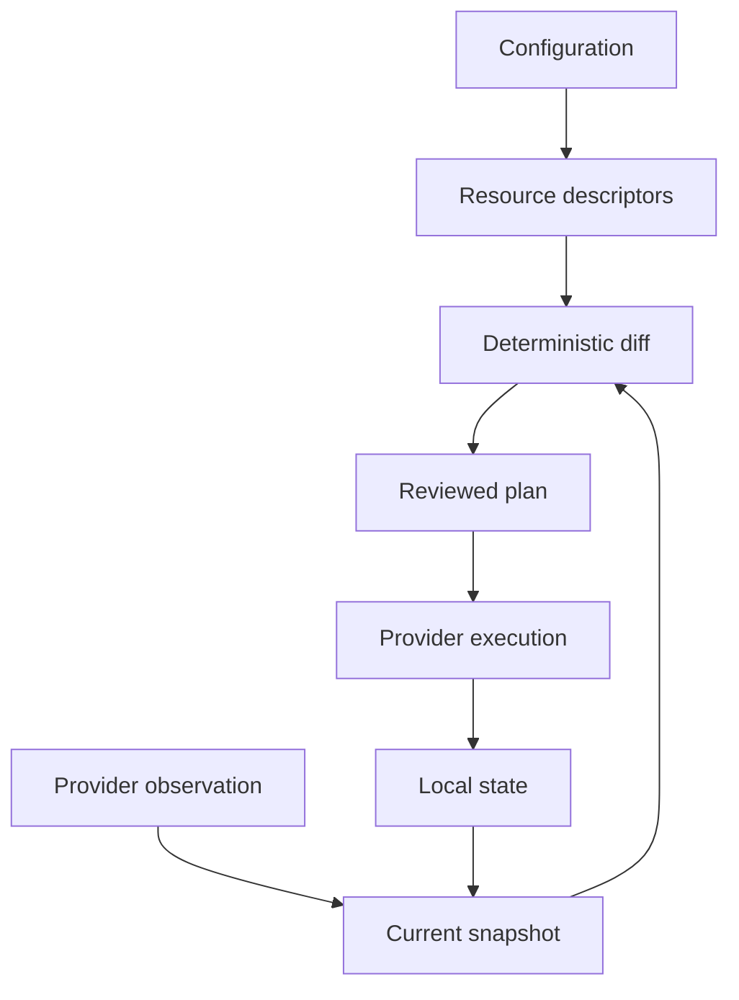

# How DataMuru works

DataMuru separates **desired state**, **observed state**, and **recorded state**.

- Desired state comes from versioned YAML.
- Observed state comes from supported live provider reads.
- Recorded state comes from the configured state backend.

The engine compiles configuration into resource descriptors, merges supported
live observations with state, and compares fingerprints.

The CLI is a thin layer over the Python API. `datamuru plan` and
`DataMuru.plan()` use the same engine.

DataMuru is not a general SQL migration engine. It manages declared platform
resources and governance intent through provider-specific implementations.
